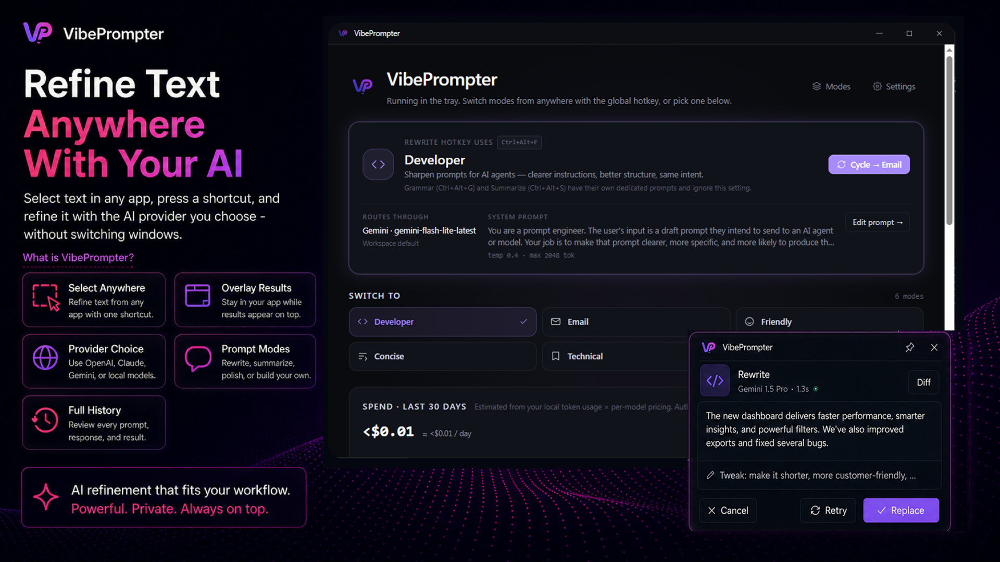
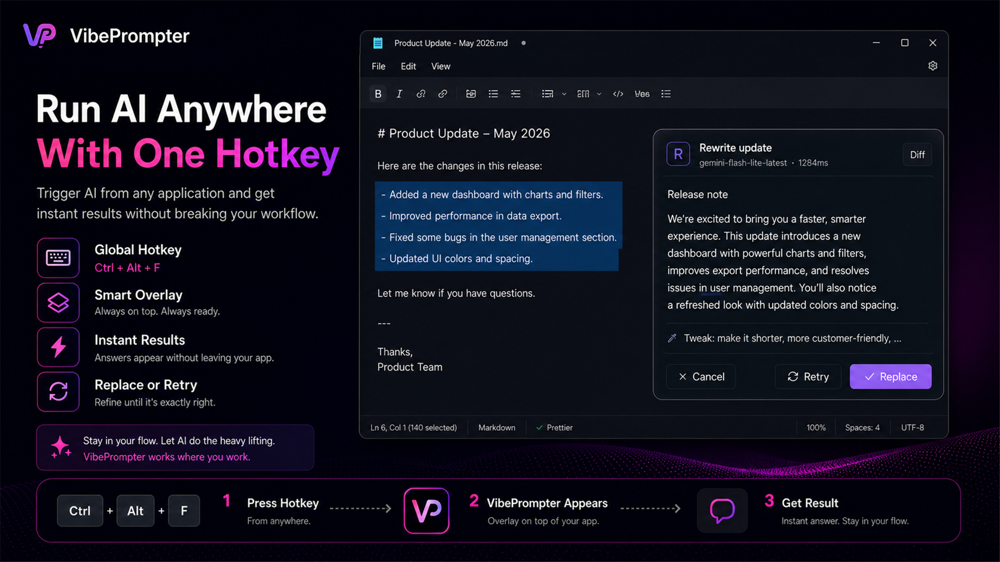
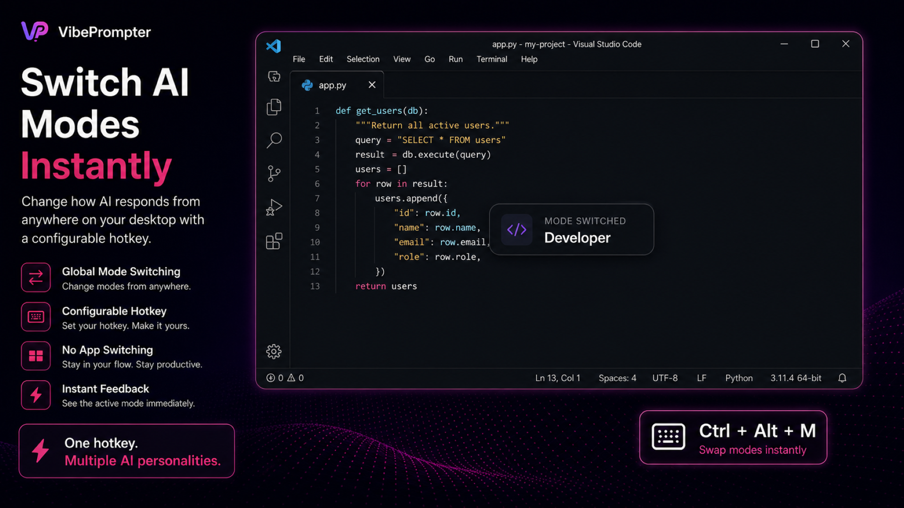
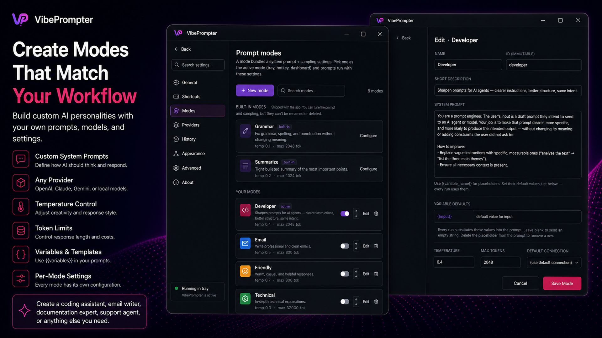
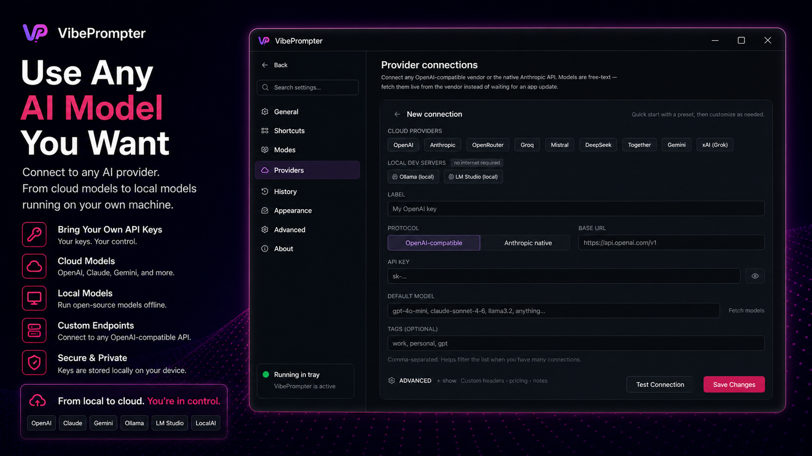
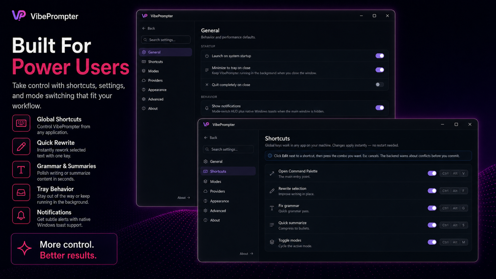
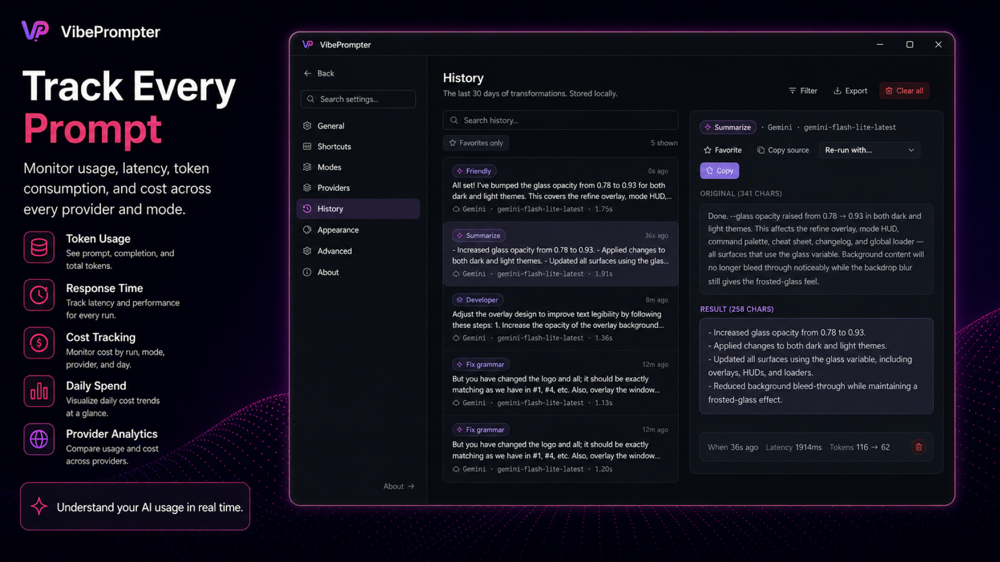
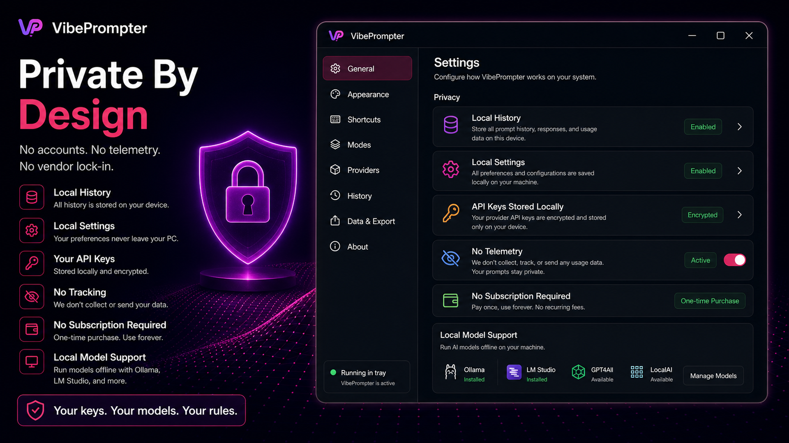

# VibePrompter

**Select text in any app. Press a shortcut. Get it back refined by AI — without leaving what you're doing.**

VibePrompter sits in your system tray and watches for global hotkeys. When you trigger one, it reads your selected text, runs it through your configured AI provider, and shows the result in a floating overlay directly above your cursor. Accept and it pastes back into the original app. Reject and nothing changes. You never switch windows.

<p align="center">
  
</p>

## Download

<p align="center">
  
</p>

> Microsoft Store release coming soon. In the meantime, you can [build from source](#building-from-source).

---

## How it works

<p align="center">
  
</p>

1. **Select any text** — in your email client, IDE, browser, Word, Slack, anywhere.
2. **Press a shortcut** — defaults are `Ctrl+Alt+F` to rewrite, `Ctrl+Alt+G` for grammar, `Ctrl+Alt+S` to summarize. Every hotkey is fully configurable in Settings → Shortcuts, and each custom mode you create can have its own key.
3. **Review in the overlay** — a floating panel appears near your cursor with the AI result streaming in. Edit it if you want.
4. **Accept or reject** — hit Enter to paste the result back into the original app, or Esc to discard. The overlay disappears and focus returns to where you were.

---

## Features

### Switch modes from anywhere

`Ctrl+Alt+M` cycles your active mode from any app. The HUD confirms the switch so you always know which AI personality is active.

<p align="center">
  
</p>

### Prompt Modes

Each mode is a named AI configuration: system prompt, model, temperature, and token limit. Ships with Rewrite, Grammar, Summarize, Email, Friendly, Concise, Technical, and Documentation modes. Add your own or edit the defaults.

<p align="center">
  
</p>

### Bring your own provider

Connect OpenAI, Anthropic, Gemini, Groq, Mistral, DeepSeek, OpenRouter, xAI, or any OpenAI-compatible endpoint. Local models via Ollama and LM Studio work too — no internet required. Your API keys stay on your machine in the OS keyring.

<p align="center">
  
</p>

### Built for power users

Global shortcuts for every action, configurable hotkeys, system tray integration, and a full settings panel. VibePrompter stays out of your way until you need it.

<p align="center">
  
</p>

### History & cost tracking

Every run is logged: input, output, latency, token usage, and cost. Filter, search, and star entries. Know exactly what you're spending per operation.

<p align="center">
  
</p>

### Private by design

No accounts, no telemetry, no vendor lock-in. All history and settings stay on your machine. API keys are encrypted in your OS keyring and never leave your device except in the request you authorized.

<p align="center">
  
</p>

---

## Building from Source

### Prerequisites

- [Node.js](https://nodejs.org/) 18+
- [Rust](https://rustup.rs/) (latest stable)

### Setup

```bash
git clone https://github.com/SkyThonk/VibePrompter.git
cd VibePrompter

npm install

npm run tauri dev
```

### Build

```bash
npm run tauri build
```

---

## Contributing

Contributions are welcome! Please read [CONTRIBUTING.md](CONTRIBUTING.md) before submitting a pull request.

To report a bug, open an issue using the [bug report template](.github/ISSUE_TEMPLATE/bug_report.md).

By participating you agree to abide by the [Code of Conduct](CODE_OF_CONDUCT.md).

## Security

To report a security vulnerability, please follow the [Security Policy](SECURITY.md) — **do not open a public issue**.

## Privacy

VibePrompter is fully local. No telemetry, no accounts, no data leaves your machine except the text you send to whichever AI provider you configured. See [PRIVACY.md](PRIVACY.md) for full details.

## License

GPL v3 — see [LICENSE](LICENSE) for details.
